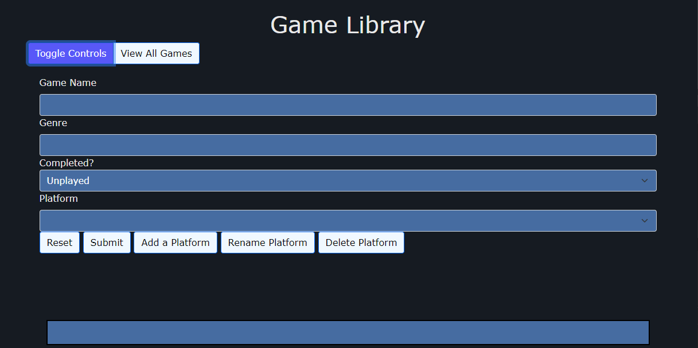
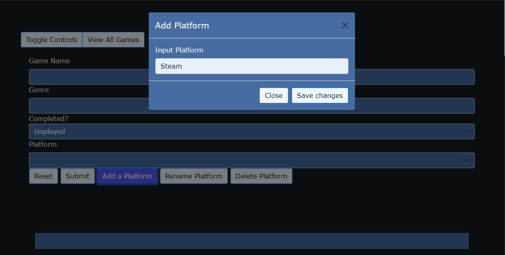
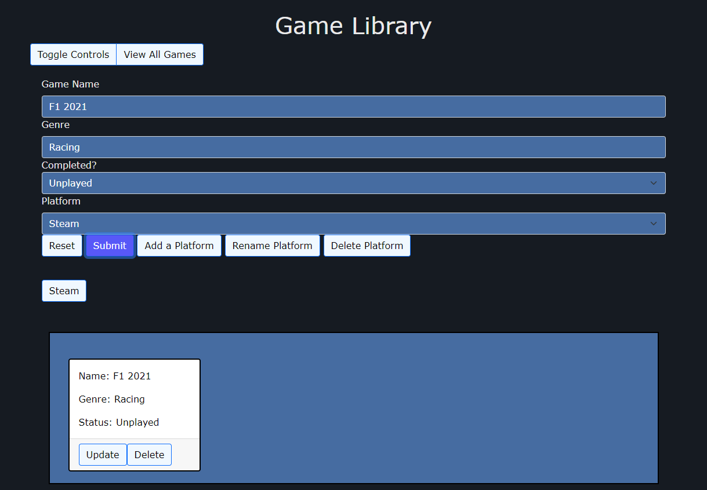

# Game Library

This application provides a way for a user to track their owned videogames across multiple platforms. It interacts with a database that stores platforms and games. A user can create, read, update and delete both of these entities. The displayed games can also be filtered by platform.

See the Documentation folder for a UML Class Diagram for the backend and an Entity Relationship Diagram for the database.

## Getting Started

These instructions will get you a copy of the project up and running on your local machine for development and testing purposes. See deployment for notes on how to deploy the project on a live system.

### Prerequisites

1. JDK 11. This project was developed with [OpenJDK](https://adoptopenjdk.net/).
2. An IDE that is compatible with Java. This project was developed with [Eclipse](https://www.eclipse.org/downloads/).
3. [Spring Tools 4](https://marketplace.eclipse.org/content/spring-tools-4-aka-spring-tool-suite-4), includes Maven for building and handling dependencies.
4. [Git](https://git-scm.com/downloads) version control to download the repository.
5. A local MySQL database. This requires installation of [MySQL](https://dev.mysql.com/doc/mysql-installation-excerpt/8.0/en/installing.html).

### Installing

1. Use Git Bash or Command Prompt in the folder where you want to install the project.
2. Clone down the repo with this command:
```
git clone https://github.com/JamesBarnett44/GameLibrary.git
```
3. Import the project into your IDE workspace:
    * Go to File -> Import
    * In the Maven folder, select Existing Maven Projects
    * Browse to the location of the cloned repo
    * Press Finish

### Example Usage
After running the application from the jar or from the IDE navigate to [localhost:8080](http://localhost:8080/). When the program starts the library will be empty. To start adding platforms and games first toggle the controls:



First you will need to add a platform by pressing the "Add a Platform" button, entering the name of the platform and pressing "Save Changes".



The platform will be added to the screen and in the dropdown menu in the game entry form. Now fill in the rest of the form and press "Submit" to add the game to the library:



The library now contains a platform with one game, which can be updated or deleted. When more platforms are added the libary can be filtered by clicking on a platform. 

## Running the tests

The project contains tests using Mockito, JUnit 5 and Selenium that are run automatically when the project is built. They can be run manually by right clicking on the project or an individual test class and selecting Run As JUnit Test. To view the code coverage instead select Coverage As JUnit Test.

### Unit Testing 

Unit tests target discrete blocks of code to prove that they function as expected. These tests used Mockito to create mock objects so that I didn't have to worry about dependencies while testing. In the example below the GameController class is being tested. This class uses another class, GameService, that is being mocked for this test:
```
@Autowired
private GameController controller;

@MockBean
private GameService service;

@Test
void testCreateGame() {
    // GIVEN
    Game testData = new Game("Subnautica", "Survival", "Completed");
    GameDTO createdDTO = new GameDTO(2, "Subnautica", "Survival", "Completed");

    // WHEN
    Mockito.when(service.createGame(testData)).thenReturn(createdDTO);

    // THEN
    assertThat(this.controller.createGame(testData)).isEqualTo(createdDTO);

    Mockito.verify(this.service, Mockito.times(1)).createGame(testData);
 }
```

### Integration Testing 

Integration tests involve combining seperate modules and testing them together. Springs' MockMVC was used to send requests which are handled by the application, then the response is checked. The example below tests the creation of a game in the database: 
```
@Test
void testCreate() throws Exception {
    Game testGame = new Game("Subnautica", "RPG", "Completed");
    String testGameAsJSON = this.mapper.writeValueAsString(testGame);

    GameDTO testSavedGame = new GameDTO(2, "Subnautica", "RPG", "Completed");
    String testSavedGameAsJSON = this.mapper.writeValueAsString(testSavedGame);
    System.out.println(testSavedGameAsJSON);

    this.mvc.perform(post("/games/create").content(testGameAsJSON).contentType(MediaType.APPLICATION_JSON))
	.andExpect(status().isOk()).andExpect(content().json(testSavedGameAsJSON));
 }
```

### User Acceptance Testing

User acceptance testing involves interacting with the application in real life scenarios. For this project it was automated using Selenium. These tests can interact with the DOM like a user (clicking buttons, filling forms) and then check specified elements to determine if the page is working as intended. The example below tests adding a game to the library.

There is a class that represents the page and contains the elements and interactions:
```
public class GameLibraryIndex {

@FindBy(xpath = "/html/body/main/div[1]/a")
private WebElement gameformButton;

@FindBy(id = "gameName")
private WebElement gameNameField;

@FindBy(id = "genre")
private WebElement genreField;

@FindBy(id = "submitGameButton")
private WebElement submitGameButton;	

public void toggleForm() {
	gameformButton.click();
 }

public void createGame(String gameName, String genre) {
	gameNameField.sendKeys(gameName);
	genreField.sendKeys(genre);
	submitGameButton.click();
 }

}
```

Then the main test class can create an instance of that class, use the methods and test functionality, in this case checking that a new game with the specified title has been created:
```
@Test
void testCreateGame() {
    GameLibraryIndex GameLibrary = PageFactory.initElements(driver, GameLibraryIndex.class);
    driver.get(URL);
    GameLibrary.toggleForm();
    new WebDriverWait(driver, 5).until(ExpectedConditions.elementToBeClickable(By.id("submitGameButton")));

    GameLibrary.createGame("Brigador", "Action");
    new WebDriverWait(driver, 5)
	    .until(ExpectedConditions.visibilityOfElementLocated(By.xpath("//*[@id=\"2\"]/div[1]/p[1]")));

    targ = driver.findElement(By.xpath("//*[@id=\"2\"]/div[1]/p[1]"));
    assertThat(targ.getText()).isEqualTo("Name: Brigador");
 }
```

## Deployment
To build a fat .jar file from the project run the command:
```
mvn clean package
```
To run the built jar file use the command:
```
java -jar GameLibrary-0.0.1-SNAPSHOT.jar
```
## Project Board
[Jira Invite Link](https://id.atlassian.com/invite/p/jira-software?id=vSzHHcE1RkaGbTZcZZRG3Q)

[Project Board](https://jamesbarnettdemo.atlassian.net/jira/software/projects/GL/boards/7)

## Built With

* [Maven](https://maven.apache.org/) - Dependency Management

## Versioning

We use [SemVer](http://semver.org/) for versioning.

## Authors

* **James Barnett** - *Completed system* - [JamesBarnett44](https://github.com/JamesBarnett44)

## License

This project is licensed under the MIT license - see the [LICENSE.md](LICENSE.md) file for details 

*For help in [Choosing a license](https://choosealicense.com/)*

## Acknowledgments

* The QA trainers
* Team Birch
